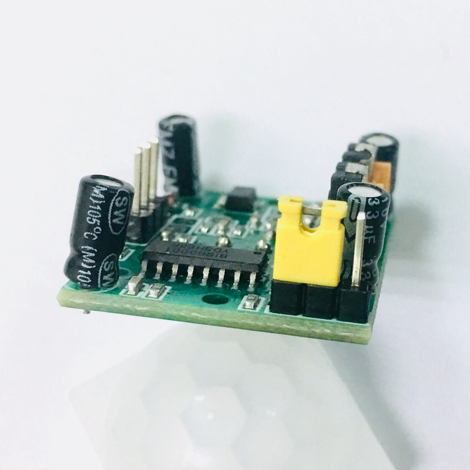
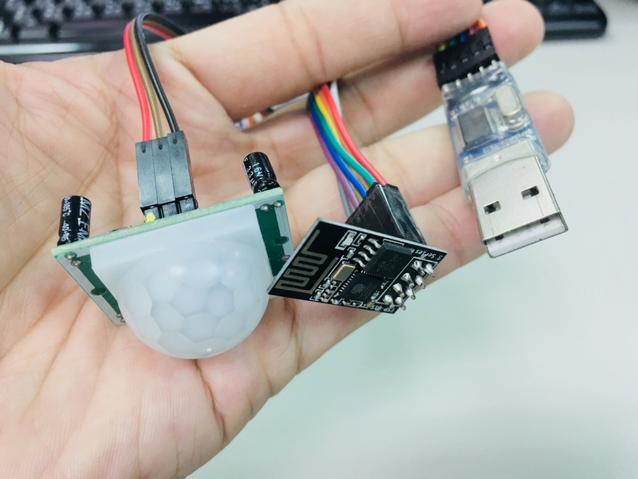

# HC-SR501 PIR Motion Detector

## Purpose

在辦公室使用 HC-SR501 PIR Motion Detector 感測座位上是否有人。

## Components Required

* PIR Motion Detector -- HC-SR501
* WiFi Module -- ESP8266 (ESP-01 model)
* USB to Serial Breakout Board

## PIR Motion Detector

使用非常便宜的 HC-SR501

它有三根 pin 腳，如果不確定 pin define 的話，把上面的菲涅爾透鏡移除就可以看到標示，OUT pin 將根據是否偵測到 "motion" 輸出 3.3V High/Low 的訊號。

感測器本身有三個可設定的部分，左邊的黃色 Jumper 設定觸發模式為 `H:重複觸發` 或是 `L:非重複觸發`。較靠近 Jumper 的旋鈕用來設定 `靈敏度`，較遠的旋鈕設定 `延遲時間`

詳細的說明，這篇已經寫得很好了，不再多說：[Arduino HC-SR501 Motion Sensor Tutorial](http://henrysbench.capnfatz.com/henrys-bench/arduino-sensors-and-input/arduino-hc-sr501-motion-sensor-tutorial/)

### My PIR setup

靈敏度 (Sensitivity) 影響的是感測距離，規格是 3~7 公尺。下圖是我之前第一次測試的時候調整的狀況。Sensitivity (左邊) 逆時針轉到底再回一點點，Time Delay (右邊) 逆時針轉到底。

測試幾天後發現 Sensitivity 只要轉一點點，在我的使用場域 -- 辦公室的座位上，誤判率就會提升，所以目前我還是把 Sensitivity 調到最低 (逆時針轉到底)。Time Delay 倒是可以調高一點 (逆時針轉到底再回一點點)。結果就是以這張圖兩邊對調的調整方式運作。

觸發模式使用 H:重複觸發。

還是需要強調，你必須配合你的使用場域調整最適合的參數。

## ESP8266 WiFi Module 

使用 ESP-01

ESP8266 系列，其實會使用它只是因為它體積最小，不然它的可用 IO 還真少 =_= 你可能會買到標示 ESP-01 或是 ESP-01S 的版本。ESP-01S 是比較新的版本，據說功耗後比較低，但也有人說其實 ESP-01 已經算低了，沒差很多。也有些模組標榜可以連廠商私有的 cloud service，但我從沒用過，也因為最終還是會替換為我們自己寫的程式，所以其實應該選便宜的就好。

### Programming ESP-01 with Arduino IDE

以前我會用 Arduino Nano 當主要 MCU，然後再接上 ESP8266 module，並透過 UART 與之通訊。但其實 ESP8266 本身就有 MCU，也可以透過燒錄方式使用 Arduino IDE 當開發環境，為了讓整體的體積最小，所以我打算試試看這樣做。

至於燒錄方式，網路上已經有很多教學了，我其實是找了一個最簡單的影片，跟著做就無痛成功了：[Getting Started with ESP 8266 ESP 01 with Arduino IDE | Programming esp-01 with Arduino ide](https://www.youtube.com/watch?v=P8Z-ZHwNeNI)

你也可以去買像下圖左邊那樣的除錯工具。事實上他就是一個 USB-to-serial 然後再放個針座讓你直插 ESP-01。

但是這個 USB module 並不是設計用來燒錄用的，它只讓你在 run-time 運作時使用，無法切換到燒錄模式，所以你必須做點小改裝。如下圖，用一個滑動開關將 GPIO0 和 GND 接在一起。再用一個按鈕將 RST 和 GND 接在一起。

完成後，你只要插上電腦的 USB port，切換滑動開關，將 GPIO0 和 GND 接在一起，然後按一下 RST 按鈕，ESP-01 就可以切換為燒錄模式，然後你就可以用上述影片中的方式以 UART 燒錄 ESP-01 的韌體。燒錄完之後，再把滑動開關斷開 GPIO0 和 GND，然後再按一次 RST 按鈕，EPS-01 就可以運作你剛剛燒錄的程式了。

ps: 你其實也可以買得到已經做好燒錄切換的 USB 模組，不需要自己焊接。

## My Wiring Diagram & Environment Setup

由於我需要接 PIR 感測器，所以使用 USB 燒錄模組並不方便，所以我還是老實地使用麵包板接線。

跟你改裝 USB 燒錄模組所做的事情一樣，記得把 RST 和 GPIO0 接出來，會讓你的開發測試流程更方便。

另一點要注意的是 USB-to-Serial 的模組選擇。市面上常見的主晶片是 PL2303、CH340、CP2101、FT232。哪一種好呢？比較貴的比較好 XD　

我現在所使用的是 PL2303，但很奇怪的是，我有兩個 "長得一樣" 的 PL2303，但是其中一個燒錄的時候無法偵測到 ESP-01 的存在，另一個卻可以！？我會建議買貴一點的 (ex: FT232) 是因為你比較不會遇到問題。

當你在燒錄的時候，Arduino IDE 的 log 會出現 "Connecting..."，如果你用的 USB-to-serial 模組沒問題的話，大多時候都可以偵測得到。少數狀況下你還需要按一下 RST 按鍵。

另外，建議買 Breakout Board 上有 "同時"(不是切換) 提供 3.3V 和 5V 的，會比較方便。例如我的 ESP-01 使用 3.3V，但是 PIR sensor 卻需要使用 5V，有這樣同時支援的模組的話，就可以方便直接供電使用。

以下是我在麵包板上的接線圖

需要注意一點的是，由於我需要使用 ESP-01 板載的 LED 燈，因為它與 GPIO2 接在一起，所以 PIR 我只好選擇 GPIO0，並且用滑動開關切換是 PIR 運作模式，還是 UART 燒錄模式。

### 安裝環境

根據程式執行的結果和統計，最後我選擇放在鍵盤和螢幕的中間。這個位置對我想做的事情來說會有比較好的辨識成功率。

另外，如果你像我一樣，覺得 ESP-01 板載的藍光 LED 很刺眼，可以切一小段熱熔膠膠條，打火機稍微烤一下黏上去。

土炮導光板的效果，至少比較不那麼刺眼 XD

## Talk is cheap. Show me the code.

### 程式說明

其實使用 PIR motion-detector 最大的挑戰就是字面上的 "motion"，這代表你必須有 "移動"，PIR 的 out pin 才會有電壓上的變化。

關於這個問題，我在論壇上問了一些前輩，他們給了我一些其它感測器的不錯建議。但在尚未測試過那些其他感測方式之前，我們還是可以從軟體的角度下手，做一點小小的演算機制，看看能做到什麼程度。

我還是要強調一點，這邊所提供的程式碼，都是為了我的測試場域 --「辦公室」所撰寫的，當你換不同的場域的時候，它可能無法運作得很好，或是需要調整一些參數。我會在後面說明程式的參數。

主要依時間寫了三個版本:

* v1: MotionDetect_Count
* v2: MotionDetect_Period
* v3: MotionDetect_Present

如果你想直接在你的專案中使用，可以直接使用最後一版 v3，然後調整 config.h 裡面的參數即可。

事實上這三個版本的演進就說明了我怎麼設計屬於我自己的演算規則。說明如下。

### Console output format

這三版的程式執行後，console 會輸出像下面這樣格式的資訊

	{timestamp} pv:{PIR value} dc:{detected count} ndc:{no-detected count} Max(ndc):{max of ndc} {time(sec)}

* **timestamp**: 時間戳記 (上電後經過多少時間)
* **pv**: PIR current value，及 out pin 輸出的訊號。{ 0: Low, 1: High }
* **dc**: 紀錄連續偵測到 (pv=1) 的次數，一旦 pv=0 reset
* **ndc**: 紀錄沒連續偵測到 (pv=0) 的次數，一旦 pv=1 reset
* **Max(ndc)**: 目前為止 ndc 最大的次數
* **time(sec)**: 次數換成時間，由於目前程式設定是一秒偵測一次，目前其實跟 Max(ndc) 一樣。

### (v1) MotionDetect_Count

第一版的程式，其實只是要記錄上述的統計狀況。輸出如下:

	...
	00:25:12 pv:0 dc:0	ndc:7	Max(ndc):42	42sec
	00:25:13 pv:0 dc:0	ndc:8	Max(ndc):42	42sec
	00:25:14 pv:0 dc:0	ndc:9	Max(ndc):42	42sec
	00:25:15 pv:0 dc:0	ndc:10	Max(ndc):42	42sec
	00:25:16 pv:0 dc:0	ndc:11	Max(ndc):42	42sec
	00:25:17 pv:1 dc:1	ndc:0	Max(ndc):42	42sec
	00:25:18 pv:1 dc:2	ndc:0	Max(ndc):42	42sec
	00:25:19 pv:1 dc:3	ndc:0	Max(ndc):42	42sec
	00:25:20 pv:0 dc:0	ndc:1	Max(ndc):42	42sec
	00:25:21 pv:0 dc:0	ndc:2	Max(ndc):42	42sec
	00:25:22 pv:0 dc:0	ndc:3	Max(ndc):42	42sec
	00:25:23 pv:0 dc:0	ndc:4	Max(ndc):42	42sec
	00:25:24 pv:1 dc:1	ndc:0	Max(ndc):42	42sec
	00:25:25 pv:1 dc:2	ndc:0	Max(ndc):42	42sec
	00:25:26 pv:1 dc:3	ndc:0	Max(ndc):42	42sec
	00:25:27 pv:0 dc:0	ndc:1	Max(ndc):42	42sec
	00:25:28 pv:0 dc:0	ndc:2	Max(ndc):42	42sec
	00:25:29 pv:0 dc:0	ndc:3	Max(ndc):42	42sec
	00:25:30 pv:0 dc:0	ndc:4	Max(ndc):42	42sec
	00:25:31 pv:1 dc:1	ndc:0	Max(ndc):42	42sec
	00:25:32 pv:1 dc:2	ndc:0	Max(ndc):42	42sec
	00:25:33 pv:0 dc:0	ndc:1	Max(ndc):42	42sec
	00:25:34 pv:0 dc:0	ndc:2	Max(ndc):42	42sec
	00:25:35 pv:0 dc:0	ndc:3	Max(ndc):42	42sec
	00:25:36 pv:0 dc:0	ndc:4	Max(ndc):42	42sec
	00:25:37 pv:0 dc:0	ndc:5	Max(ndc):42	42sec

這一版如同名字 "_Count" 所示，只是做紀錄而已，用來觀察數據的變化是否有規則可用。

### (v2) MotionDetect_Period

因為做了第一版的程式，我放在位子一整天，觀察數據規律後，我發現通常我自己在位子上很難兩分鐘內完全不動，完全不被 PIR 識別到。

所以改寫了第二版，多了 "Period" 的觀察，我想知道一旦 PIR 偵測到動作，往後的 60 秒內，會被再偵測到的次數有幾次。因為這個資訊有機會能拿來當作判斷的依據。

以下是 console 輸出，一旦 pv=1 之後，會統計之後的 60 秒內 pv=1 的累加狀況。

	...
	00:17:39  pv:1 dc:2	ndc:0	Max(ndc):27  27sec   | 20
	00:17:40  pv:1 dc:3	ndc:0	Max(ndc):27  27sec   | 21
	00:17:41  pv:1 dc:4	ndc:0	Max(ndc):27  27sec   | 22
	00:17:42  pv:1 dc:5	ndc:0	Max(ndc):27  27sec   | 23
	00:17:43  pv:0 dc:0	ndc:1	Max(ndc):27  27sec __x 23
	00:17:44  pv:0 dc:0	ndc:2	Max(ndc):27  27sec
	00:17:45  pv:0 dc:0	ndc:3	Max(ndc):27  27sec
	00:17:46  pv:0 dc:0	ndc:4	Max(ndc):27  27sec
	00:17:47  pv:0 dc:0	ndc:5	Max(ndc):27  27sec
	00:17:48  pv:1 dc:1	ndc:0	Max(ndc):27  27sec --* (60sec)
	00:17:49  pv:1 dc:2	ndc:0	Max(ndc):27  27sec   | 1
	00:17:50  pv:1 dc:3	ndc:0	Max(ndc):27  27sec   | 2
	00:17:51  pv:1 dc:4	ndc:0	Max(ndc):27  27sec   | 3
	00:17:52  pv:1 dc:5	ndc:0	Max(ndc):27  27sec   | 4
	00:17:53  pv:1 dc:6	ndc:0	Max(ndc):27  27sec   | 5
	00:17:54  pv:1 dc:7	ndc:0	Max(ndc):27  27sec   | 6
	...
	00:18:23  pv:0 dc:0	ndc:2	Max(ndc):27  27sec   | 10
	00:18:24  pv:0 dc:0	ndc:3	Max(ndc):27  27sec   | 10
	00:18:25  pv:0 dc:0	ndc:4	Max(ndc):27  27sec   | 10
	00:18:26  pv:0 dc:0	ndc:5	Max(ndc):27  27sec   | 10
	00:18:27  pv:1 dc:1	ndc:0	Max(ndc):27  27sec   | 11
	00:18:28  pv:0 dc:0	ndc:1	Max(ndc):27  27sec   | 11
	...
	00:18:45  pv:1 dc:1	ndc:0	Max(ndc):27  27sec   | 16
	00:18:46  pv:0 dc:0	ndc:1	Max(ndc):27  27sec   | 16
	00:18:47  pv:0 dc:0	ndc:2	Max(ndc):27  27sec   | 16
	00:18:48  pv:0 dc:0	ndc:3	Max(ndc):27  27sec __x 16
	00:18:49  pv:0 dc:0	ndc:4	Max(ndc):27  27sec
	00:18:50  pv:0 dc:0	ndc:5	Max(ndc):27  27sec
	00:18:51  pv:0 dc:0	ndc:6	Max(ndc):27  27sec
	00:18:52  pv:0 dc:0	ndc:7	Max(ndc):27  27sec
	00:18:53  pv:0 dc:0	ndc:8	Max(ndc):27  27sec
	00:18:54  pv:1 dc:1	ndc:0	Max(ndc):27  27sec --* (60sec)
	00:18:55  pv:0 dc:0	ndc:1	Max(ndc):27  27sec   | 0
	00:18:56  pv:0 dc:0	ndc:2	Max(ndc):27  27sec   | 0
	00:18:57  pv:0 dc:0	ndc:3	Max(ndc):27  27sec   | 0
	...
	00:19:17  pv:0 dc:0	ndc:23	Max(ndc):27  27sec   | 0
	00:19:18  pv:0 dc:0	ndc:24	Max(ndc):27  27sec   | 0
	00:19:19  pv:0 dc:0	ndc:25	Max(ndc):27  27sec   | 0
	00:19:20  pv:0 dc:0	ndc:26	Max(ndc):27  27sec   | 0
	00:19:21  pv:1 dc:1	ndc:0	Max(ndc):27  27sec   | 1
	00:19:22  pv:0 dc:0	ndc:1	Max(ndc):27  27sec   | 1
	00:19:23  pv:0 dc:0	ndc:2	Max(ndc):27  27sec   | 1
	00:19:24  pv:0 dc:0	ndc:3	Max(ndc):27  27sec   | 1
	00:19:25  pv:0 dc:0	ndc:4	Max(ndc):27  27sec   | 1
	00:19:26  pv:0 dc:0	ndc:5	Max(ndc):27  27sec   | 1
	00:19:27  pv:0 dc:0	ndc:6	Max(ndc):27  27sec   | 1
	00:19:28  pv:0 dc:0	ndc:7	Max(ndc):27  27sec   | 1
	00:19:29  pv:0 dc:0	ndc:8	Max(ndc):27  27sec   | 1
	00:19:30  pv:1 dc:1	ndc:0	Max(ndc):27  27sec   | 2
	00:19:31  pv:1 dc:2	ndc:0	Max(ndc):27  27sec   | 3
	00:19:32  pv:0 dc:0	ndc:1	Max(ndc):27  27sec   | 3
	00:19:33  pv:0 dc:0	ndc:2	Max(ndc):27  27sec   | 3
	...
	00:19:51  pv:0 dc:0	ndc:20	Max(ndc):27  27sec   | 3
	00:19:52  pv:0 dc:0	ndc:21	Max(ndc):27  27sec   | 3
	00:19:53  pv:0 dc:0	ndc:22	Max(ndc):27  27sec   | 3
	00:19:54  pv:0 dc:0	ndc:23	Max(ndc):27  27sec __x 3
	00:19:55  pv:0 dc:0	ndc:24	Max(ndc):27  27sec
	00:19:56  pv:0 dc:0	ndc:25	Max(ndc):27  27sec
	...

### (v3) MotionDetect_Present

最後，根據 v2 給我的靈感和觀察，我所設定的規則是:

	一旦 PIR 偵測到動作連續 3 次，往後的 60 秒內，如果累計偵測次數超過 10 次，就認定有人坐在座位上。
	一旦 PIR 連續 90 秒都沒有偵測到動靜，就認定人已離開座位。

console 的輸出增加了 O 和 X，表示系統認定結果。

* O: the system recognizes that someone really exists there
* X: the system recognizes that someone leaves already

會這樣做的原因是不希望判別結果一直反覆的震盪，像是明明坐在位子上，系統卻顯示一下子出現，一下子又不見，然後馬上又出現...

當然這樣做的缺點就是，系統需要在一段延遲時間後，才能反映出狀況。

另一點是關於雜訊的處理，我曾經在下班後繼續讓系統運作，隔天發現 PIR 偶爾會出現 1~2 次的偵測訊號 (pv=1)，但其實當時根本沒人而且鬼月已經過了 XD

所以我在程式裡面會將這些視為雜訊忽略。

console output:

	00:01:00  pv:0 dc:0	ndc:1	Max(ndc):1 ... [X]
	...
	00:01:06  pv:1 dc:2	ndc:5	Max(ndc):5 ... [X]
	00:01:07  pv:1 dc:3	ndc:0	Max(ndc):5 ... [X] --* (60sec)
	00:01:08  pv:1 dc:4	ndc:0	Max(ndc):5 ... [X]   | 1
	00:01:09  pv:1 dc:5	ndc:0	Max(ndc):5 ... [X]   | 2
	00:01:10  pv:1 dc:6	ndc:0	Max(ndc):5 ... [X]   | 3
	00:01:11  pv:1 dc:7	ndc:0	Max(ndc):5 ... [X]   | 4
	00:01:12  pv:0 dc:0	ndc:1	Max(ndc):5 ... [X]   | 4
	00:01:13  pv:0 dc:0	ndc:2	Max(ndc):5 ... [X]   | 4
	00:01:14  pv:0 dc:0	ndc:3	Max(ndc):5 ... [X]   | 4
	...
	00:01:43  pv:0 dc:0	ndc:17	Max(ndc):17 ... [X]   | 9
	00:01:44  pv:0 dc:0	ndc:18	Max(ndc):18 ... [X]   | 9
	00:01:45  pv:0 dc:0	ndc:19	Max(ndc):19 ... [X]   | 9
	00:01:46  pv:0 dc:0	ndc:20	Max(ndc):20 ... [X]   | 9
	00:01:47  pv:1 dc:1	ndc:0	Max(ndc):20 ... [O]   | 10 #<= 這裡超過 10 次，判定人在位子上
	00:01:48  pv:1 dc:2	ndc:0	Max(ndc):20 ... [O]   | 11
	00:01:49  pv:0 dc:0	ndc:1	Max(ndc):20 ... [O]   | 11
	...
	00:02:03  pv:0 dc:0	ndc:2	Max(ndc):20 ... [O]   | 13
	00:02:04  pv:0 dc:0	ndc:3	Max(ndc):20 ... [O]   | 13
	00:02:05  pv:0 dc:0	ndc:4	Max(ndc):20 ... [O]   | 13
	00:02:06  pv:0 dc:0	ndc:5	Max(ndc):20 ... [O]   | 13
	00:02:07  pv:0 dc:0	ndc:6	Max(ndc):20 ... [O] __x 13
	00:02:08  pv:0 dc:0	ndc:7	Max(ndc):20 ... [O]
	00:02:09  pv:0 dc:0	ndc:8	Max(ndc):20 ... [O]
	00:02:10  pv:0 dc:0	ndc:9	Max(ndc):20 ... [O]
	...
	00:02:39  pv:0 dc:0	ndc:37	Max(ndc):37 ... [O]
	00:02:40  pv:0 dc:0	ndc:38	Max(ndc):38 ... [O]
	00:02:41  pv:0 dc:0	ndc:39	Max(ndc):39 ... [O]
	00:02:42  pv:1 dc:1	ndc:39	Max(ndc):39 ... [O] #<= pv=1 當作雜訊，忽略
	00:02:43  pv:0 dc:0	ndc:40	Max(ndc):40 ... [O]
	00:02:44  pv:0 dc:0	ndc:41	Max(ndc):41 ... [O]
	00:02:45  pv:0 dc:0	ndc:42	Max(ndc):42 ... [O]
	...
	00:03:30  pv:0 dc:0	ndc:86	Max(ndc):86 ... [O]
	00:03:31  pv:0 dc:0	ndc:87	Max(ndc):87 ... [O]
	00:03:32  pv:0 dc:0	ndc:88	Max(ndc):88 ... [O]
	00:03:33  pv:0 dc:0	ndc:89	Max(ndc):89 ... [O]
	00:03:34  pv:0 dc:0	ndc:90	Max(ndc):90 ... [X] #<= 連續 90 秒 PIR 都沒偵測到，判定人已離開
	00:03:35  pv:0 dc:0	ndc:91	Max(ndc):91 ... [X]
	00:03:36  pv:0 dc:0	ndc:92	Max(ndc):92 ... [X]
	00:03:37  pv:1 dc:1	ndc:92	Max(ndc):92 ... [X]
	00:03:38  pv:1 dc:2	ndc:92	Max(ndc):92 ... [X]
	00:03:39  pv:1 dc:3	ndc:0	Max(ndc):92 ... [X] --* (60sec)
	00:03:40  pv:1 dc:4	ndc:0	Max(ndc):92 ... [X]   | 1
	00:03:41  pv:0 dc:0	ndc:1	Max(ndc):92 ... [X]   | 1
	00:03:42  pv:0 dc:0	ndc:2	Max(ndc):92 ... [X]   | 1
	00:03:43  pv:0 dc:0	ndc:3	Max(ndc):92 ... [X]   | 1
	...
	00:04:36  pv:0 dc:0	ndc:4	Max(ndc):92 ... [X]   | 4
	00:04:37  pv:0 dc:0	ndc:5	Max(ndc):92 ... [X]   | 4
	00:04:38  pv:0 dc:0	ndc:6	Max(ndc):92 ... [X]   | 4
	00:04:39  pv:0 dc:0	ndc:7	Max(ndc):92 ... [X] __x 4 #<= 60 秒內沒有偵測超過 10 次，當作誤判不改變當前的判定結果
	00:04:40  pv:0 dc:0	ndc:8	Max(ndc):92 ... [X]
	00:04:41  pv:0 dc:0	ndc:9	Max(ndc):92 ... [X]
	...
	00:04:55  pv:1 dc:1	ndc:21	Max(ndc):92 ... [X]
	00:04:56  pv:1 dc:2	ndc:21	Max(ndc):92 ... [X]
	00:04:57  pv:1 dc:3	ndc:0	Max(ndc):92 ... [X] --* (60sec)
	00:04:58  pv:0 dc:0	ndc:1	Max(ndc):92 ... [X]   | 0
	00:04:59  pv:0 dc:0	ndc:2	Max(ndc):92 ... [X]   | 0
	00:05:00  pv:0 dc:0	ndc:3	Max(ndc):92 ... [X]   | 0
	00:05:01  pv:0 dc:0	ndc:4	Max(ndc):92 ... [X]   | 0
	00:05:02  pv:0 dc:0	ndc:5	Max(ndc):92 ... [X]   | 0
	00:05:03  pv:1 dc:1	ndc:0	Max(ndc):92 ... [X]   | 1
	00:05:04  pv:1 dc:2	ndc:0	Max(ndc):92 ... [X]   | 2
	00:05:05  pv:1 dc:3	ndc:0	Max(ndc):92 ... [X]   | 3
	00:05:06  pv:0 dc:0	ndc:1	Max(ndc):92 ... [X]   | 3
	...
	00:05:40  pv:0 dc:0	ndc:8	Max(ndc):92 ... [X]   | 6
	00:05:41  pv:1 dc:1	ndc:0	Max(ndc):92 ... [X]   | 7
	00:05:42  pv:1 dc:2	ndc:0	Max(ndc):92 ... [X]   | 8
	00:05:43  pv:1 dc:3	ndc:0	Max(ndc):92 ... [X]   | 9
	00:05:44  pv:1 dc:4	ndc:0	Max(ndc):92 ... [O]   | 10
	00:05:45  pv:1 dc:5	ndc:0	Max(ndc):92 ... [O]   | 11
	...
	00:05:55  pv:0 dc:0	ndc:6	Max(ndc):92 ... [O]   | 15
	00:05:56  pv:0 dc:0	ndc:7	Max(ndc):92 ... [O]   | 15
	00:05:57  pv:0 dc:0	ndc:8	Max(ndc):92 ... [O] __x 15
	00:05:58  pv:0 dc:0	ndc:9	Max(ndc):92 ... [O]
	00:05:59  pv:0 dc:0	ndc:10	Max(ndc):92 ... [O]
	00:06:00  pv:0 dc:0	ndc:11	Max(ndc):92 ... [O]
	...

## v3 config.h Adjustment 

如果你需要使用 v3 在你的場域內，你需要調整的參數就是下面這幾個:

	/* =================================================================
	   According to your usage situation adjust the following parameters
	   ================================================================= */
	
	#define CHK_PERIOD_TIME         (60 * 1000)   /* period 時間的長度，目前是 60 秒 */
	#define THRESHOLD_PRESENT       10            /* period 時間內，被偵測到幾次當作是人在位子 */
	#define THRESHOLD_LEAVE         90            /* 連續沒被偵測 (pv=0) 到幾次當作人已離開 */
	#define CFG_IGNORE_NOISES       1             /* 使否使用雜訊過濾功能 1:on 0:off */
	#define IGNORE_NOISES_NUM       2             /* 連續幾次以下的都當作是雜訊 */

### LICENSE

	/*
	 * --------------------------------------------------------------------------------
	 * "THE BEER-WARE LICENSE" (Revision 42):
	 * <yenchang.lin@gmail.com>  wrote this program.  As long as you retain this notice
	 * you can do whatever you want with this stuff. If we meet some day, and you think
	 * this stuff is worth it, you can buy me a beer in return.  Andrew Lin
	 * --------------------------------------------------------------------------------
	 */

	/*
	 * ---------------------------------------------------------------------
	 * "啤酒授權條款"（修訂版 R42）：
	 * <yenchang.lin@gmail.com> 寫了這個程式。只要你保留這個授權條款在你的文檔中，
	 * 你就可以用這些文檔做任何你想做的事。如果我們有一天我們有緣見到面，
	 * 而你覺得我寫的這個東西對你有幫助，你可以請我喝一杯啤酒作為回報。   Andrew Lin
	 * ---------------------------------------------------------------------
	 */
